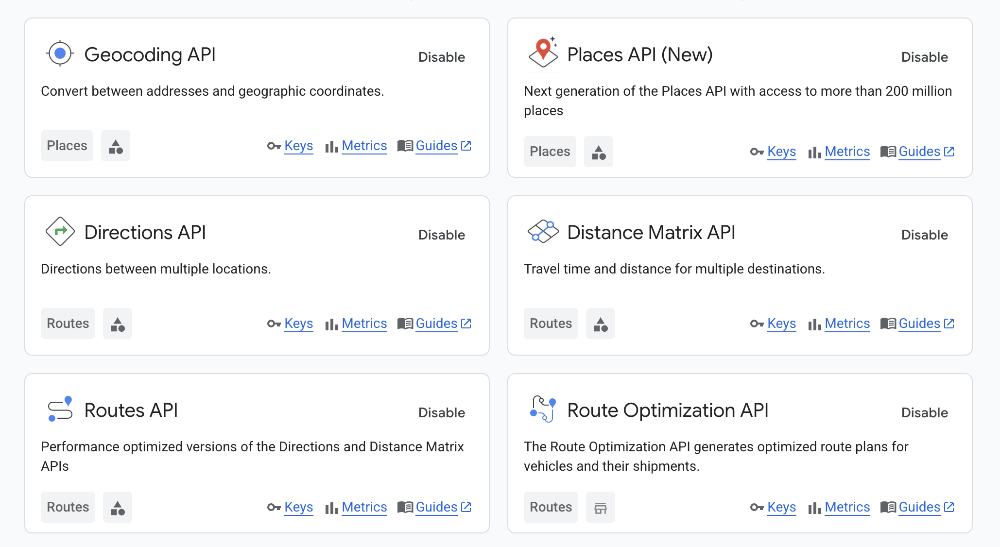

# Belajar Menggunakan AI #

Project ini dibuat untuk mencoba fitur fitur terbaru dalam melakukan riset dengan AI. Tidak hanya menggunakan AI model seperti ChatGPT, Gemini, dan lain-lain. Namun juga menggunakan MCP server untuk memperkaya hasil riset. Penjelasan lebih lanjut mengenai MCP server bisa dilihat di [blog saya](https://software.endy.muhardin.com/ai/mcp-server-gmap/).

Prompt yang digunakan dalam project ini [dibuat menggunakan ChatGPT](https://chatgpt.com/share/680213b9-4d84-800a-8559-f051d200b4ff).

## MCP Server yang digunakan dalam project ini ##

* [Brave Search](https://github.com/modelcontextprotocol/servers/tree/main/src/brave-search)
* [Fetch-MCP](https://github.com/zcaceres/fetch-mcp)
* [Google Maps MCP](https://github.com/modelcontextprotocol/servers/tree/main/src/google-maps)

Google Map API yang dibutuhkan untuk project ini adalah :

* Geocoding API
* Places API
* Directions API
* Distance Matrix API
* Routes API

## Cara menggunakan project ini ##
1. Clone repository ini
2. Buka foldernya dengan Visual Studio Code
3. Install extension [Cline](https://marketplace.visualstudio.com/items/?itemName=saoudrizwan.claude-dev) dan [RooCode](https://roocode.com/)
4. Install MCP server yang digunakan di RooCode. Cline bisa digunakan untuk memudahkan instalasi. 
5. Aktivasi [Boomerang di RooCode](https://docs.roocode.com/features/boomerang-tasks)
6. Pastikan API key sudah terpasang dengan baik untuk :
   * Google Maps
   * Brave Search
   * Model AI yang digunakan
7. Buka prompt di RooCode, masuk ke Boomerang Mode, dan suruh dia untuk menjalankan prompt di file [road_trip_bogor_jateng_prompt.md](road_trip_bogor_jateng_prompt.md)
8. Selamat mencoba!

## Contoh hasil ##

Contoh hasil dapat dilihat di folder [riset_road_trip_bogor_jateng](riset_road_trip_bogor_jateng). Ini adalah hasil eksekusi di laptop saya.